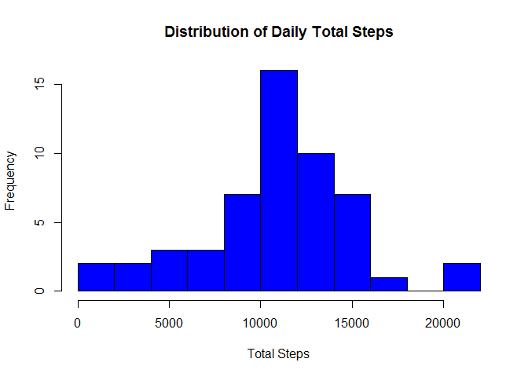
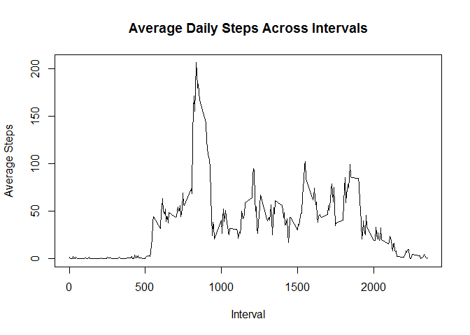
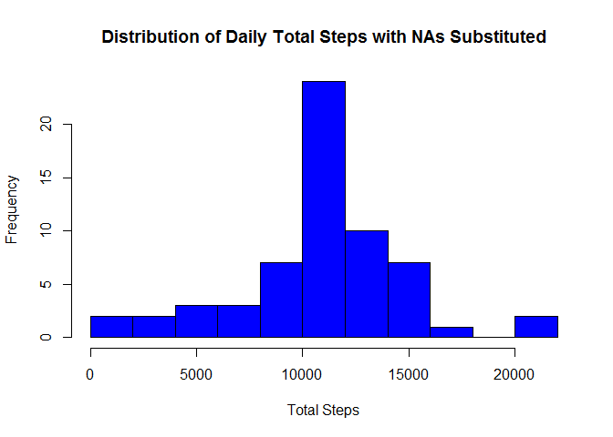
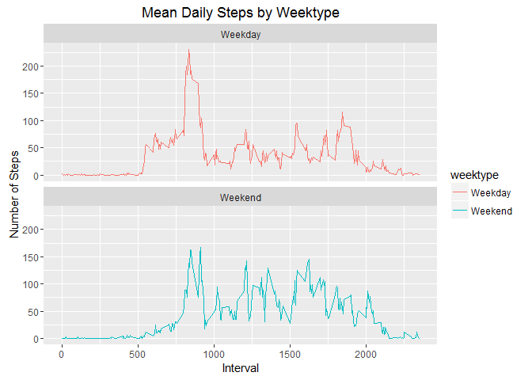

# Reproducible Research: Peer Assessment 1
##Fork and Clone the Original Repository

The first step of the analysis is to fork to the original repository 
created for this assignment. The repository is located on under R.D. Peng's 
GitHub repository titled [RepData_PeerAssesment1] [1].
[1]: https://github.com/rdpeng/RepData_PeerAssessment1  "RepData_PeerAssesment1"
The original data raw data is included in the repository along with detailed 
instructions for the assignment.

Once the repository was forked to my personal GitHub repository a clone of the 
project was pulled from the link to my [repository] [2] into R Studio.
[2]: https://github.com/splas/RepData_PeerAssessment1  "repository"

## Loading and Preprocessing of the Data

The zip folder containing the data from the repository then require unipping 
and reading into R Studio.


```r
setwd("~/Reproducible Research/Week 2/Project1/RepData_PeerAssessment1")
unzip("activity.zip")
activity <- read.csv("activity.csv", sep= ",")
activity$date<- as.Date(activity$date)
```

## What is mean total number of steps taken per day?

Histogram showing the distribution of total steps taken each day.

```r
dailysteps <- aggregate(steps~date, activity, sum)
hist(dailysteps$steps, col ="blue", breaks=10, xlab="Total Steps", 
     ylab = "Frequency", main = "Distribution of Daily Total Steps")
```

<!-- -->

What is mean total number of steps taken per day?

```r
mean(dailysteps$steps)
```

```
## [1] 10766.19
```
The mean for the total number of steps taken each day is 10.766.19

What is median total number of steps taken per day?

```r
median(dailysteps$steps)
```

```
## [1] 10765
```
The median is 10,765 steps.

## What is the average daily activity pattern?

The time series plot below looks at the 5 minute interval(x-axis) and the 
average numberof steps taken, averaged across all days(y-axis).

```r
interval <- aggregate(steps~interval, activity, mean)
with(interval, plot(interval, steps, type = "l", xlab = "Interval", 
                    ylab = "Average Steps", 
                    main = "Average Daily Steps Across Intervals"))
```

<!-- -->

The maximum number of steps for a 5-minute interval was 206 steps.


Which 5-minute interval, on average across all the days in the dataset, contains
the maximum number of steps?

```r
interval[which.max(interval$steps),]
```

```
##     interval    steps
## 104      835 206.1698
```
The 5 minute interval that contained the maximum number of steps was the 835 
interval.


## Imputing missing values

What is the total number of missing values in the original dataset?

```r
sum(is.na(activity$steps))
```

```
## [1] 2304
```
The total number of rows with steps with a NA value is 2304.

For my strategy of replacing the NAs, I inputted the average mean for each day.
I first created a new data set.


```r
library(dplyr)
```

```
## 
## Attaching package: 'dplyr'
```

```
## The following objects are masked from 'package:stats':
## 
##     filter, lag
```

```
## The following objects are masked from 'package:base':
## 
##     intersect, setdiff, setequal, union
```

```r
activity2<- activity
nas<- is.na(activity2$steps)
mean_interval<- tapply(activity2$steps, activity2$interval, mean, na.rm=TRUE,
                       simplify = TRUE)
activity2$steps[nas] <- mean_interval[as.character(activity2$interval[nas])]
```

A historgam was then created to show the total number of steps taken each day.

```r
dailysteps2 <- aggregate(steps~date, activity2, sum)
hist(dailysteps2$steps, col ="blue", breaks=10, xlab="Total Steps", 
     ylab = "Frequency", 
     main = "Distribution of Daily Total Steps with NAs Substituted")
```

<!-- -->

What is mean total number of steps taken per day for the data with values 
substituted for the NA values?

```r
mean(dailysteps2$steps)
```

```
## [1] 10766.19
```
The mean for the data with substituted values for the NAs is 10,766.19.

What is median total number of steps taken per day for the data with values 
substituted for the NA values?

```r
median(dailysteps2$steps)
```

```
## [1] 10766.19
```
The median for the data with substituted values for the NAs is 10,766.19. 

The impact of inputting missing values in this manner caused the mean and median
to end up as the same. Other methods could potentially skew the data in other 
ways such as inflating the values.

## Are there differences in activity patterns between weekdays and weekends?

To answer this question, a new factor variable was created from the data set 
with the NAs replaced that identified whether the day was a week day or a 
weekend.


```r
library(dplyr)
activity2<- activity2%>%
        mutate(weektype= ifelse(weekdays(activity2$date)=="Saturday" | 
                                        weekdays(activity2$date)=="Sunday",
                                "Weekend", "Weekday"))
##Aggregate data by weektype.
interval2 <- aggregate(steps~interval+weektype, activity2, mean)
##Plot data.
library(ggplot2)
```

```
## Warning: package 'ggplot2' was built under R version 3.3.1
```

```r
g<- ggplot(interval2, aes(x =interval , y=steps, color=weektype)) +
       geom_line() +
       labs(title = "Mean Daily Steps by Weektype", x = "Interval", 
            y = "Number of Steps") + facet_wrap(~weektype, ncol = 1, nrow=2)
print(g)
```

<!-- -->

The data shows that the individual studied was consistently more active 
throughout the weekend versus weekdays.
